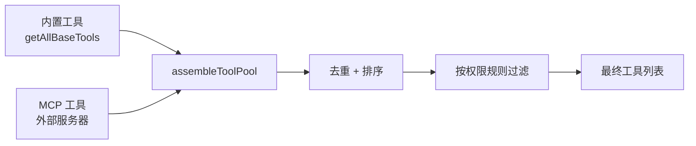
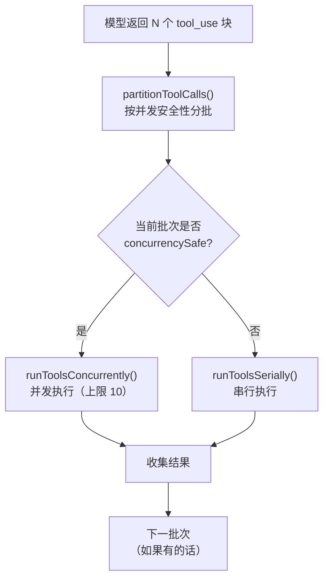
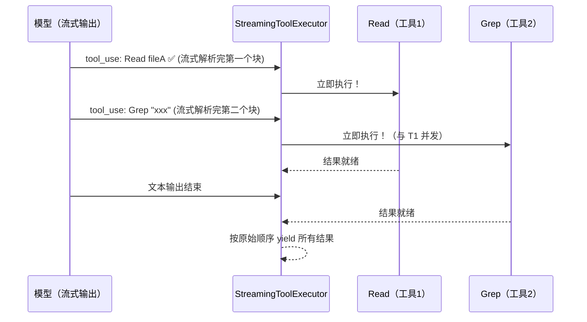
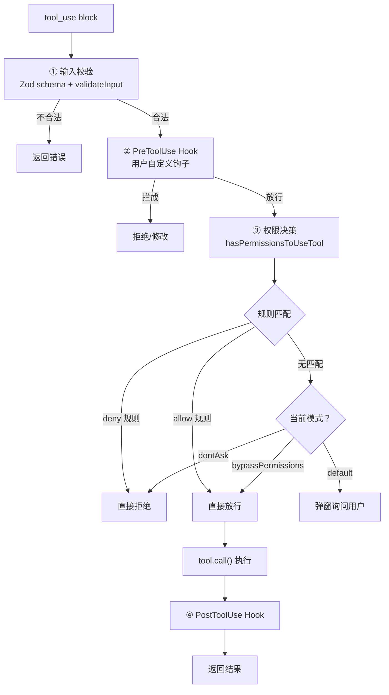

# CC 源码解读

## 引子：CC 到底在干什么？

你在终端敲一句话，CC 就能帮你改代码、跑测试、读文档……它是怎么做到的？

答案只有一个循环：**调模型 → 拿到工具调用 → 执行工具 → 把结果喂回模型 → 再来一轮**。

这就是 `Agent Loop` —— 整个 CC 的心脏。


## 1. The Agent Loop


每轮结束，对话历史多一条工具结果消息。模型看到工具结果再决定下一步：继续调用工具，还是直接回复用户。

**这就是"Agent"和"普通聊天"的本质区别：模型不只是回答问题，它还能自己决定"我需要先做点什么"。**

### 源码定位

Agent Loop 由两层构成：

- **内层** `query()`（[query.ts:307](src/query.ts#L307)）— 真正的 while(true) 循环：调模型 → 收集 tool_use → 执行工具 → 拼回消息 → 下一轮
- **外层** `QueryEngine.submitMessage()`（[QueryEngine.ts:675](src/QueryEngine.ts#L675)）— 消费 `query()` yield 出的消息，按类型分发处理

#### 内层：query.ts — 真正的 Agent Loop

```typescript
// query.ts 第 307 行
// ⚠️ 以下为简化伪代码，突出核心骨架，省略了错误恢复 / compact / streaming 等逻辑
while (true) {
  // ① 调用模型 API（流式）
  for await (const message of callModel({ messages, systemPrompt, tools })) {
    yield message                              // 向外层推送流式消息
    if (message.type === 'assistant') {
      assistantMessages.push(message)
      // 收集本轮所有 tool_use 块
      const blocks = message.content.filter(c => c.type === 'tool_use')
      toolUseBlocks.push(...blocks)
      if (blocks.length > 0) needsFollowUp = true
    }
  }

  // ② 没有工具调用 → 模型说完了，正常退出
  if (!needsFollowUp) {
    return { reason: 'completed' }
  }

  // ③ 有工具调用 → 批量执行工具
  for await (const update of runTools(toolUseBlocks, canUseTool, context)) {
    yield update.message                       // 向外层推送工具结果
    toolResults.push(update.message)
  }

  // ④ 检查是否超过最大轮次
  if (maxTurns && nextTurnCount > maxTurns) {
    yield { type: 'max_turns_reached', turnCount: nextTurnCount }
    return { reason: 'max_turns' }
  }

  // ⑤ 把 assistant + toolResults 拼回消息列表，进入下一轮
  state = {
    messages: [...messages, ...assistantMessages, ...toolResults],
    turnCount: nextTurnCount,
  }
} // while (true)
```

#### 外层：QueryEngine.ts — 消费 + 分发

内层 query() 是一个 async generator，每 yield 一条消息，外层就接住并处理。可以理解为：**query() 是引擎，QueryEngine 是仪表盘**。

```typescript
// QueryEngine.ts 第 675 行（简化伪代码）
for await (const message of query({ messages, systemPrompt, tools, maxTurns })) {

  // 记录消息到会话历史
  if (message.type === 'assistant' || message.type === 'user') {
    messages.push(message)
    await recordTranscript(messages)           // 持久化会话
  }

  switch (message.type) {
    case 'assistant':
      this.mutableMessages.push(message)
      yield* normalizeMessage(message)         // 转为 SDK 事件推给调用方（终端、VSCode、桌面端）
      break

    case 'stream_event':
      // 实时累计 token 用量（用于预算控制）
      if (message.event.type === 'message_stop') {
        this.totalUsage = accumulateUsage(this.totalUsage, currentMessageUsage)
      }
      break

    case 'tool_use_summary':
      // 工具执行摘要（给 UI 展示一行简要说明）
      yield { type: 'tool_use_summary', summary: message.summary }
      break
  }

  // 超预算 → 终止
  if (maxBudgetUsd !== undefined && getTotalCost() >= maxBudgetUsd) {
    yield { type: 'result', subtype: 'error_max_budget_usd' }
    return
  }
}
```

> **为什么分两层？**
> - `query()` 是纯逻辑的 async generator，只管「调模型 → 跑工具 → 循环」
> - `QueryEngine` 负责工程侧关切：会话持久化、token 计费、SDK 事件格式化
> - 好处：想换模型供应商？只改 query 内部。想换 UI 框架？只改 QueryEngine 的 yield 格式。互不干扰。
>
> **为什么是两个终止条件？**
> - `maxTurns`（最大轮次）—— 防止死循环，在内层 query() 中检查
> - `maxBudgetUsd`（最大预算）—— 防止超支，在外层 QueryEngine 中检查
> - 一个管"跑了多少轮"，一个管"花了多少钱"，互补兜底

### 小结

Agent Loop 的本质就一句话：**while(true) { 问模型 → 跑工具 → 把结果喂回去 }，直到模型说"我说完了"或者触发安全阀。**

记住这个循环，后面的 Tool Use、TodoWrite、Subagent 都是往这个循环里"塞东西"。

## 2. Tool Use

 Agent Loop 的核心是"调模型 → 跑工具 → 循环"。那**工具**到底是什么？模型怎么知道有哪些工具？工具怎么跑的？权限谁来管？

### 一个工具长什么样？

每个工具就是一个 TypeScript 对象，通过 `buildTool()` 构建（[源码Tool.ts:783](src/Tool.ts#L783)）。核心字段：

```typescript
// ⚠️ 简化示意，完整定义见 Tool.ts 第 362 行
interface Tool {
  name: string                          // 工具名，如 "Read"、"Bash"
  inputSchema: ZodSchema                // 输入参数校验（Zod）
  
  // 核心：执行工具
  call(args, context, canUseTool): Promise<ToolResult>
  
  // 权限检查：这个调用该不该放行？
  checkPermissions(input, context): Promise<PermissionResult>
  
  // 并发安全？只读？破坏性？—— 决定调度策略
  isConcurrencySafe(input): boolean     // true → 可以和其他只读工具并发
  isReadOnly(input): boolean            // true → 不会修改文件系统
  isDestructive?(input): boolean        // true → 会删除/覆写文件
  
  // 渲染：给终端 / VSCode / 桌面端展示
  renderToolUseMessage(input): ReactNode
  renderToolResultMessage?(output): ReactNode
}
```

举个例子，**Read 工具**（[FileReadTool.ts](src/tools/FileReadTool/FileReadTool.ts)）大概长这样：

```typescript
export const FileReadTool = buildTool({
  name: 'Read',
  inputSchema: z.object({ file_path: z.string(), offset: z.number().optional(), limit: z.number().optional() }),
  
  async call({ file_path, offset, limit }, context) {
    // 读文件，返回内容
    return { content: await readFile(file_path, { offset, limit }) }
  },
  
  isConcurrencySafe: () => true,   // 读文件不影响别人
  isReadOnly: () => true,          // 不修改任何东西
  maxResultSizeChars: Infinity,    // 不截断
})
```

对比 **Edit 工具**（[FileEditTool.ts:86](src/tools/FileEditTool/FileEditTool.ts#L86)）：

```typescript
export const FileEditTool = buildTool({
  name: 'Edit',
  isConcurrencySafe: () => false,  // 写文件不能并发
  isReadOnly: () => false,
  isDestructive: () => true,       // 会修改文件
  
  async checkPermissions(input, context) {
    // 检查写权限、敏感文件保护……
  }
})
```

> **设计要点**：每个工具自己声明"我是否安全"，而不是由调度器猜。这让调度策略和工具定义解耦。

### 工具从哪来？



源码位置：[tools.ts:190](src/tools.ts#L190)

```typescript
// ⚠️ 简化伪代码
function getAllBaseTools(): Tool[] {
  return [
    BashTool, FileReadTool, FileEditTool, FileWriteTool,
    GlobTool, GrepTool, AgentTool, TodoWriteTool,
    WebSearchTool, WebFetchTool, NotebookEditTool,
    ToolSearchTool, SkillTool, ...cronTools,
    // ... 共 40+ 个内置工具
  ]
}

// tools.ts 第 345 行 — 内置 + MCP 合并
function assembleToolPool(permissionContext, mcpTools): Tool[] {
  const builtIn = getTools(permissionContext)          // 内置工具（已按权限过滤）
  const mcp = filterToolsByDenyRules(mcpTools)         // MCP 工具（已按规则过滤）
  return uniqBy([...builtIn, ...mcp].sort(byName), 'name')  // 去重，内置优先
}
```

这里有个巧妙的设计——**Deferred Tools（延迟加载）**：

CC 有 40+ 个内置工具，再加上用户配置的 MCP 工具，全部塞进 system prompt 会非常占 token。所以：

- 核心工具（Read、Edit、Bash 等）**始终加载**
- MCP 工具和低频工具标记为 `shouldDefer: true`，**只发名字不发 schema**
- 模型需要时调用 `ToolSearch` 工具，按关键词搜索，**按需加载完整定义**

```typescript
// prompt.ts — 判断是否延迟加载
function isDeferredTool(tool: Tool): boolean {
  if (tool.alwaysLoad) return false     // 显式豁免
  if (tool.isMcp) return true           // 所有 MCP 工具默认延迟
  if (tool.shouldDefer) return true     // 标记了延迟
  return false
}
```

> 就像一个工具箱：常用扳手放在最上层随手拿，不常用的专用工具放抽屉里，需要的时候再翻出来。

### 工具怎么跑？—— 编排引擎

上一节的 Agent Loop 里，`runTools()` 一行代码就跑完了所有工具。但这行代码背后是一套精巧的**编排引擎**：



源码位置：[toolOrchestration.ts:19](src/services/tools/toolOrchestration.ts#L19)

核心逻辑——**分区调度**：

```typescript
// ⚠️ 简化伪代码
function partitionToolCalls(toolUseBlocks, tools): Batch[] {
  return toolUseBlocks.reduce((batches, block) => {
    const tool = findToolByName(tools, block.name)
    const safe = tool?.isConcurrencySafe(block.input)
    
    // 关键：相邻的安全工具合并成一批并发执行
    if (safe && batches.at(-1)?.isConcurrencySafe) {
      batches.at(-1).blocks.push(block)
    } else {
      batches.push({ isConcurrencySafe: safe, blocks: [block] })
    }
    return batches
  }, [])
}
```

**举个例子**，模型一次返回 4 个工具调用：

| 顺序 | 工具 | concurrencySafe | 分批 |
|------|------|----------------|------|
| 1 | Read fileA | ✅ | 批次 1（并发） |
| 2 | Read fileB | ✅ | 批次 1（并发） |
| 3 | Edit fileC | ❌ | 批次 2（串行） |
| 4 | Read fileD | ✅ | 批次 3（并发） |

执行顺序：**Read A + Read B 并发 → Edit C 独占 → Read D**

> 这就像厨房规则：切菜（只读）可以多人同时干，但炒菜（写操作）同一时刻只能一个人用锅。

### 更激进的优化：流式工具执行

普通模式下，模型**说完所有话**才开始跑工具。但 CC 还有一个 `StreamingToolExecutor`（[StreamingToolExecutor.ts:40](src/services/tools/StreamingToolExecutor.ts#L40)），能做到**模型还在输出时就开始执行工具**：



```typescript
// StreamingToolExecutor — 核心思路
class StreamingToolExecutor {
  addTool(block: ToolUseBlock) {
    this.tools.push({ id: block.id, status: 'queued' })
    void this.processQueue()       // 立即尝试执行！不等模型说完
  }
  
  private canExecuteTool(isConcurrencySafe: boolean): boolean {
    const executing = this.tools.filter(t => t.status === 'executing')
    // 同样遵守并发安全规则
    return executing.length === 0 ||
      (isConcurrencySafe && executing.every(t => t.isConcurrencySafe))
  }
}
```

> 这让"模型思考"和"工具执行"**流水线化**，而不是"想完再做"。网络延迟 + 工具执行时间被大幅压缩。

### 权限系统：谁来管工具能不能跑？

工具不是想跑就跑。从 tool_use 到真正执行，要过**三道关**：



源码位置：[permissions.ts:473](src/utils/permissions/permissions.ts#L473)，[toolExecution.ts:337](src/services/tools/toolExecution.ts#L337)

权限决策的优先级（简化版）：

```typescript
// ⚠️ 简化伪代码，实际代码约 500 行
async function hasPermissionsToUseTool(tool, input, context) {
  // 1. deny 规则 → 直接拒绝（最高优先级）
  if (getDenyRuleForTool(context, tool)) return { behavior: 'deny' }
  
  // 2. 工具自身的权限检查（如 Edit 检查敏感文件）
  const toolCheck = await tool.checkPermissions(input, context)
  if (toolCheck.behavior === 'deny') return toolCheck
  
  // 3. bypassPermissions 模式 → 全部放行
  if (mode === 'bypassPermissions') return { behavior: 'allow' }
  
  // 4. allow 规则 → 放行
  if (getAllowRuleForTool(context, tool)) return { behavior: 'allow' }
  
  // 5. 兜底：按模式处理
  if (mode === 'dontAsk') return { behavior: 'deny' }  // 无头模式，不能问就拒绝
  return { behavior: 'ask' }                             // 默认模式，弹窗问用户
}
```

> **权限规则来自哪？** 用户的 `settings.json` 中配置 `allowedTools` 和 `deniedTools`，也可以在 `.claude/settings.json`（项目级）中配置。第一次用某工具时弹窗问你，你点"Always allow"就会写入规则。

### 小结

Tool Use 系统的设计哲学：**工具自描述、调度自适应、权限分层管。**

- 每个工具自己声明能力（只读？安全？破坏性？），调度器据此决定并发还是串行
- 延迟加载让 40+ 工具不会撑爆 prompt
- 权限三道关（校验 → Hook → 规则）保证安全，又不影响效率

回到 Agent Loop：模型说"我要用 Read 和 Edit"，Loop 调 `runTools()`，工具系统分批并发跑完，把结果喂回去。**就这么简单，也就这么精巧。**
