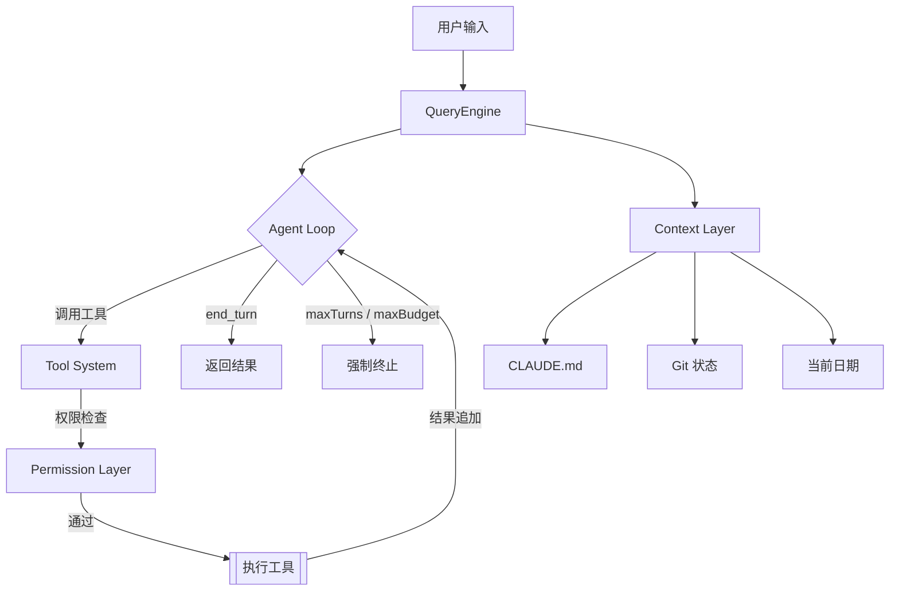
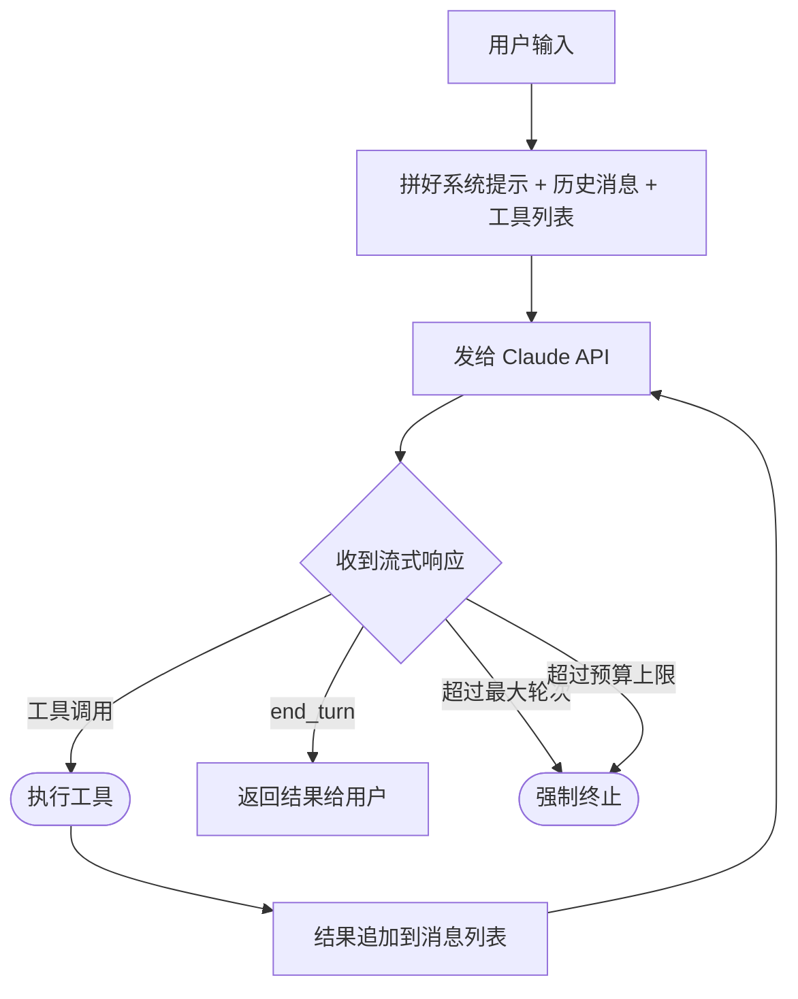

# CC 源码解读

## 工作流程



## Agent Loop 流程



### 源码定位

Agent Loop 的核心实现在 `QueryEngine.submitMessage()` 中，关键代码位于 [QueryEngine.ts:675-686](src/QueryEngine.ts#L675-L686)：

```typescript
for await (const message of query({
  messages,
  systemPrompt,
  userContext,
  systemContext,
  canUseTool: wrappedCanUseTool,
  toolUseContext: processUserInputContext,
  fallbackModel,
  querySource: 'sdk',
  maxTurns,
  taskBudget,
})) {
  // 根据 message.type 分发处理
}
```

`query()` 是一个 **async generator**，每次 yield 一条消息。循环体内通过 `switch (message.type)` 处理不同类型：

| message.type | 处理逻辑 |
|---|---|
| `assistant` | 推入 mutableMessages，yield 给调用方 |
| `user` | 推入 mutableMessages，turnCount++ |
| `stream_event` | 累计 token 用量（message_start/message_delta/message_stop） |
| `attachment` | 处理 structured_output、**max_turns_reached** 等信号 |
| `system` | 处理 compact_boundary（上下文压缩）、api_error（重试） |

循环结束后还有两道守卫检查：
- **预算超限**：`getTotalCost() >= maxBudgetUsd` → yield `error_max_budget_usd`
- **结构化输出重试上限**：连续失败次数 ≥ `MAX_STRUCTURED_OUTPUT_RETRIES` → yield `error_max_structured_output_retries`