# CC 源码解读

## 引子：CC 到底在干什么？

你在终端敲一句话，CC 就能帮你改代码、跑测试、读文档……它是怎么做到的？

答案只有一个循环：**调模型 → 拿到工具调用 → 执行工具 → 把结果喂回模型 → 再来一轮**。

这就是 `Agent Loop` —— 整个 CC 的心脏。


## 1. The Agent Loop


每轮结束，对话历史多一条工具结果消息。模型看到工具结果再决定下一步：继续调用工具，还是直接回复用户。

**这就是"Agent"和"普通聊天"的本质区别：模型不只是回答问题，它还能自己决定"我需要先做点什么"。**

### 源码定位

Agent Loop 由两层构成：

- **内层** `query()`（[query.ts:307](src/query.ts#L307)）— 真正的 while(true) 循环：调模型 → 收集 tool_use → 执行工具 → 拼回消息 → 下一轮
- **外层** `QueryEngine.submitMessage()`（[QueryEngine.ts:675](src/QueryEngine.ts#L675)）— 消费 `query()` yield 出的消息，按类型分发处理

#### 内层：query.ts — 真正的 Agent Loop

```typescript
// query.ts 第 307 行
// ⚠️ 以下为简化伪代码，突出核心骨架，省略了错误恢复 / compact / streaming 等逻辑
while (true) {
  // ① 调用模型 API（流式）
  for await (const message of callModel({ messages, systemPrompt, tools })) {
    yield message                              // 向外层推送流式消息
    if (message.type === 'assistant') {
      assistantMessages.push(message)
      // 收集本轮所有 tool_use 块
      const blocks = message.content.filter(c => c.type === 'tool_use')
      toolUseBlocks.push(...blocks)
      if (blocks.length > 0) needsFollowUp = true
    }
  }

  // ② 没有工具调用 → 模型说完了，正常退出
  if (!needsFollowUp) {
    return { reason: 'completed' }
  }

  // ③ 有工具调用 → 批量执行工具
  for await (const update of runTools(toolUseBlocks, canUseTool, context)) {
    yield update.message                       // 向外层推送工具结果
    toolResults.push(update.message)
  }

  // ④ 检查是否超过最大轮次
  if (maxTurns && nextTurnCount > maxTurns) {
    yield { type: 'max_turns_reached', turnCount: nextTurnCount }
    return { reason: 'max_turns' }
  }

  // ⑤ 把 assistant + toolResults 拼回消息列表，进入下一轮
  state = {
    messages: [...messages, ...assistantMessages, ...toolResults],
    turnCount: nextTurnCount,
  }
} // while (true)
```

#### 外层：QueryEngine.ts — 消费 + 分发

内层 query() 是一个 async generator，每 yield 一条消息，外层就接住并处理。可以理解为：**query() 是引擎，QueryEngine 是仪表盘**。

```typescript
// QueryEngine.ts 第 675 行（简化伪代码）
for await (const message of query({ messages, systemPrompt, tools, maxTurns })) {

  // 记录消息到会话历史
  if (message.type === 'assistant' || message.type === 'user') {
    messages.push(message)
    await recordTranscript(messages)           // 持久化会话
  }

  switch (message.type) {
    case 'assistant':
      this.mutableMessages.push(message)
      yield* normalizeMessage(message)         // 转为 SDK 事件推给调用方（终端、VSCode、桌面端）
      break

    case 'stream_event':
      // 实时累计 token 用量（用于预算控制）
      if (message.event.type === 'message_stop') {
        this.totalUsage = accumulateUsage(this.totalUsage, currentMessageUsage)
      }
      break

    case 'tool_use_summary':
      // 工具执行摘要（给 UI 展示一行简要说明）
      yield { type: 'tool_use_summary', summary: message.summary }
      break
  }

  // 超预算 → 终止
  if (maxBudgetUsd !== undefined && getTotalCost() >= maxBudgetUsd) {
    yield { type: 'result', subtype: 'error_max_budget_usd' }
    return
  }
}
```

> **为什么分两层？**
> - `query()` 是纯逻辑的 async generator，只管「调模型 → 跑工具 → 循环」
> - `QueryEngine` 负责工程侧关切：会话持久化、token 计费、SDK 事件格式化
> - 好处：想换模型供应商？只改 query 内部。想换 UI 框架？只改 QueryEngine 的 yield 格式。互不干扰。
>
> **为什么是两个终止条件？**
> - `maxTurns`（最大轮次）—— 防止死循环，在内层 query() 中检查
> - `maxBudgetUsd`（最大预算）—— 防止超支，在外层 QueryEngine 中检查
> - 一个管"跑了多少轮"，一个管"花了多少钱"，互补兜底

### 小结

Agent Loop 的本质就一句话：**while(true) { 问模型 → 跑工具 → 把结果喂回去 }，直到模型说"我说完了"或者触发安全阀。**

记住这个循环，后面的 Tool Use、TodoWrite、Subagent 都是往这个循环里"塞东西"。

## 2. Tool Use

 Agent Loop 的核心是"调模型 → 跑工具 → 循环"。那**工具**到底是什么？模型怎么知道有哪些工具？工具怎么跑的？权限谁来管？

### 一个工具长什么样？

每个工具就是一个 TypeScript 对象，通过 `buildTool()` 构建（[源码Tool.ts:783](src/Tool.ts#L783)）。核心字段：

```typescript
// ⚠️ 简化示意，完整定义见 Tool.ts 第 362 行
interface Tool {
  name: string                          // 工具名，如 "Read"、"Bash"
  inputSchema: ZodSchema                // 输入参数校验（Zod）
  
  // 核心：执行工具
  call(args, context, canUseTool): Promise<ToolResult>
  
  // 权限检查：这个调用该不该放行？
  checkPermissions(input, context): Promise<PermissionResult>
  
  // 并发安全？只读？破坏性？—— 决定调度策略
  isConcurrencySafe(input): boolean     // true → 可以和其他只读工具并发
  isReadOnly(input): boolean            // true → 不会修改文件系统
  isDestructive?(input): boolean        // true → 会删除/覆写文件
  
  // 渲染：给终端 / VSCode / 桌面端展示
  renderToolUseMessage(input): ReactNode
  renderToolResultMessage?(output): ReactNode
}
```

举个例子，**Read 工具**（[FileReadTool.ts](src/tools/FileReadTool/FileReadTool.ts)）大概长这样：

```typescript
export const FileReadTool = buildTool({
  name: 'Read',
  inputSchema: z.object({ file_path: z.string(), offset: z.number().optional(), limit: z.number().optional() }),
  
  async call({ file_path, offset, limit }, context) {
    // 读文件，返回内容
    return { content: await readFile(file_path, { offset, limit }) }
  },
  
  isConcurrencySafe: () => true,   // 读文件不影响别人
  isReadOnly: () => true,          // 不修改任何东西
  maxResultSizeChars: Infinity,    // 不截断
})
```

对比 **Edit 工具**（[FileEditTool.ts:86](src/tools/FileEditTool/FileEditTool.ts#L86)）：

```typescript
export const FileEditTool = buildTool({
  name: 'Edit',
  isConcurrencySafe: () => false,  // 写文件不能并发
  isReadOnly: () => false,
  isDestructive: () => true,       // 会修改文件
  
  async checkPermissions(input, context) {
    // 检查写权限、敏感文件保护……
  }
})
```

> **设计要点**：每个工具自己声明"我是否安全"，而不是由调度器猜。这让调度策略和工具定义解耦。

### 工具从哪来？

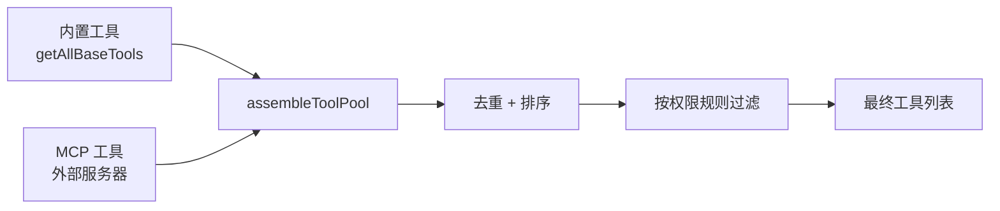

源码位置：[tools.ts:190](src/tools.ts#L190)

```typescript
// ⚠️ 简化伪代码
function getAllBaseTools(): Tool[] {
  return [
    BashTool, FileReadTool, FileEditTool, FileWriteTool,
    GlobTool, GrepTool, AgentTool, TodoWriteTool,
    WebSearchTool, WebFetchTool, NotebookEditTool,
    ToolSearchTool, SkillTool, ...cronTools,
    // ... 共 40+ 个内置工具
  ]
}

// tools.ts 第 345 行 — 内置 + MCP 合并
function assembleToolPool(permissionContext, mcpTools): Tool[] {
  const builtIn = getTools(permissionContext)          // 内置工具（已按权限过滤）
  const mcp = filterToolsByDenyRules(mcpTools)         // MCP 工具（已按规则过滤）
  return uniqBy([...builtIn, ...mcp].sort(byName), 'name')  // 去重，内置优先
}
```

这里有个巧妙的设计——**Deferred Tools（延迟加载）**：

CC 有 40+ 个内置工具，再加上用户配置的 MCP 工具，全部塞进 system prompt 会非常占 token。所以：

- 核心工具（Read、Edit、Bash 等）**始终加载**
- MCP 工具和低频工具标记为 `shouldDefer: true`，**只发名字不发 schema**
- 模型需要时调用 `ToolSearch` 工具，按关键词搜索，**按需加载完整定义**

```typescript
// prompt.ts — 判断是否延迟加载
function isDeferredTool(tool: Tool): boolean {
  if (tool.alwaysLoad) return false     // 显式豁免
  if (tool.isMcp) return true           // 所有 MCP 工具默认延迟
  if (tool.shouldDefer) return true     // 标记了延迟
  return false
}
```

> 就像一个工具箱：常用扳手放在最上层随手拿，不常用的专用工具放抽屉里，需要的时候再翻出来。

### 工具怎么跑？—— 编排引擎

上一节的 Agent Loop 里，`runTools()` 一行代码就跑完了所有工具。但这行代码背后是一套精巧的**编排引擎**：

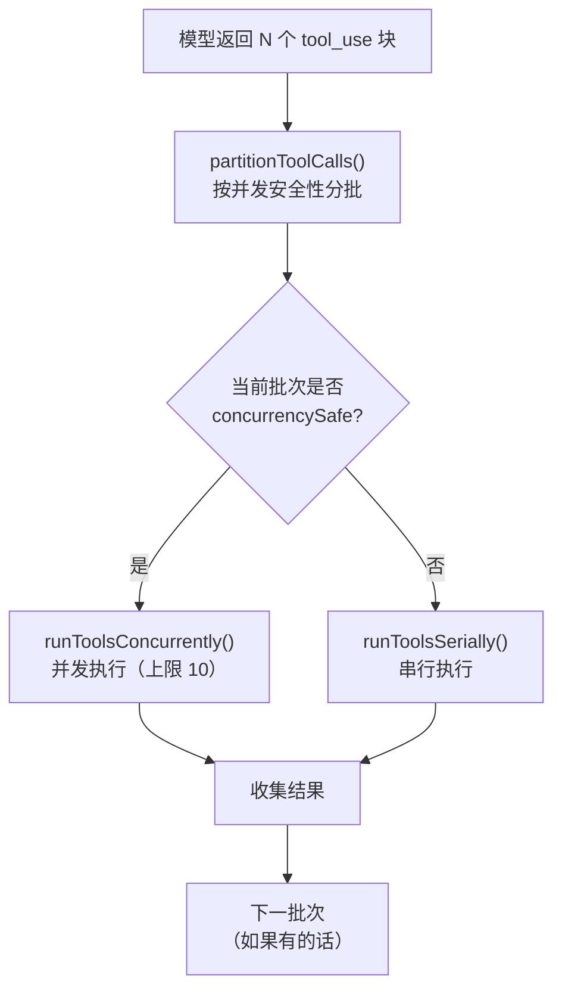

源码位置：[toolOrchestration.ts:19](src/services/tools/toolOrchestration.ts#L19)

核心逻辑——**分区调度**：

```typescript
// ⚠️ 简化伪代码
function partitionToolCalls(toolUseBlocks, tools): Batch[] {
  return toolUseBlocks.reduce((batches, block) => {
    const tool = findToolByName(tools, block.name)
    const safe = tool?.isConcurrencySafe(block.input)
    
    // 关键：相邻的安全工具合并成一批并发执行
    if (safe && batches.at(-1)?.isConcurrencySafe) {
      batches.at(-1).blocks.push(block)
    } else {
      batches.push({ isConcurrencySafe: safe, blocks: [block] })
    }
    return batches
  }, [])
}
```

**举个例子**，模型一次返回 4 个工具调用：

| 顺序 | 工具 | concurrencySafe | 分批 |
|------|------|----------------|------|
| 1 | Read fileA | ✅ | 批次 1（并发） |
| 2 | Read fileB | ✅ | 批次 1（并发） |
| 3 | Edit fileC | ❌ | 批次 2（串行） |
| 4 | Read fileD | ✅ | 批次 3（并发） |

执行顺序：**Read A + Read B 并发 → Edit C 独占 → Read D**

> 这就像厨房规则：切菜（只读）可以多人同时干，但炒菜（写操作）同一时刻只能一个人用锅。

### 更激进的优化：流式工具执行

普通模式下，模型**说完所有话**才开始跑工具。但 CC 还有一个 `StreamingToolExecutor`（[StreamingToolExecutor.ts:40](src/services/tools/StreamingToolExecutor.ts#L40)），能做到**模型还在输出时就开始执行工具**：

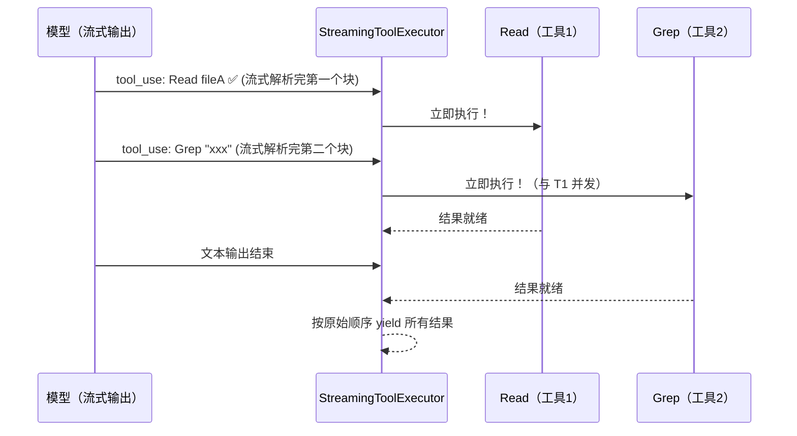

```typescript
// StreamingToolExecutor — 核心思路
class StreamingToolExecutor {
  addTool(block: ToolUseBlock) {
    this.tools.push({ id: block.id, status: 'queued' })
    void this.processQueue()       // 立即尝试执行！不等模型说完
  }
  
  private canExecuteTool(isConcurrencySafe: boolean): boolean {
    const executing = this.tools.filter(t => t.status === 'executing')
    // 同样遵守并发安全规则
    return executing.length === 0 ||
      (isConcurrencySafe && executing.every(t => t.isConcurrencySafe))
  }
}
```

> 这让"模型思考"和"工具执行"**流水线化**，而不是"想完再做"。网络延迟 + 工具执行时间被大幅压缩。

### 权限系统：谁来管工具能不能跑？

工具不是想跑就跑。从 tool_use 到真正执行，要过**三道关**：

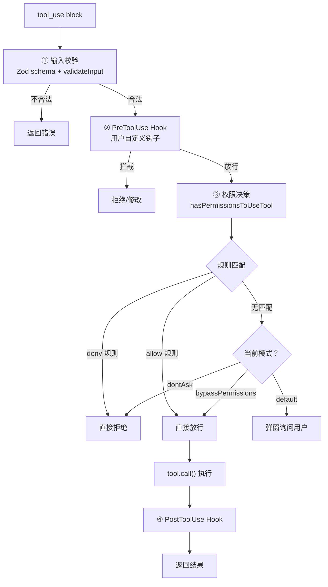

源码位置：[permissions.ts:473](src/utils/permissions/permissions.ts#L473)，[toolExecution.ts:337](src/services/tools/toolExecution.ts#L337)

权限决策的优先级（简化版）：

```typescript
// ⚠️ 简化伪代码，实际代码约 500 行
async function hasPermissionsToUseTool(tool, input, context) {
  // 1. deny 规则 → 直接拒绝（最高优先级）
  if (getDenyRuleForTool(context, tool)) return { behavior: 'deny' }
  
  // 2. 工具自身的权限检查（如 Edit 检查敏感文件）
  const toolCheck = await tool.checkPermissions(input, context)
  if (toolCheck.behavior === 'deny') return toolCheck
  
  // 3. bypassPermissions 模式 → 全部放行
  if (mode === 'bypassPermissions') return { behavior: 'allow' }
  
  // 4. allow 规则 → 放行
  if (getAllowRuleForTool(context, tool)) return { behavior: 'allow' }
  
  // 5. 兜底：按模式处理
  if (mode === 'dontAsk') return { behavior: 'deny' }  // 无头模式，不能问就拒绝
  return { behavior: 'ask' }                             // 默认模式，弹窗问用户
}
```

> **权限规则来自哪？** 用户的 `settings.json` 中配置 `allowedTools` 和 `deniedTools`，也可以在 `.claude/settings.json`（项目级）中配置。第一次用某工具时弹窗问你，你点"Always allow"就会写入规则。

### 小结

Tool Use 系统的设计哲学：**工具自描述、调度自适应、权限分层管。**

- 每个工具自己声明能力（只读？安全？破坏性？），调度器据此决定并发还是串行
- 延迟加载让 40+ 工具不会撑爆 prompt
- 权限三道关（校验 → Hook → 规则）保证安全，又不影响效率

回到 Agent Loop：模型说"我要用 Read 和 Edit"，Loop 调 `runTools()`，工具系统分批并发跑完，把结果喂回去。**就这么简单，也就这么精巧。**

## 3. TodoWrite

上一节讲了 40+ 个工具的通用执行机制。这一节聚焦一个特殊的工具——**TodoWrite**。

它不读文件、不跑命令，**它唯一的作用是帮模型记住"我现在在干嘛，接下来还要干嘛"**。

> 为什么需要它？因为 Agent Loop 可能跑几十轮。模型的注意力在每一轮都被新的工具结果淹没，很容易"做着做着忘了全局目标"。TodoWrite 就是模型给自己写的**备忘录**。

### 数据结构：一条 Todo 长什么样？

源码位置：[types.ts](src/utils/todo/types.ts)

```typescript
// 一条 Todo 就三个字段
interface TodoItem {
  content: string     // 命令式："Fix the login bug"
  status: 'pending' | 'in_progress' | 'completed'
  activeForm: string  // 进行时："Fixing the login bug"（用于 UI spinner 显示）
}

// 整个 Todo 列表就是一个数组
type TodoList = TodoItem[]
```

为什么要 `content` 和 `activeForm` 两种文案？

- `content`（命令式）给模型自己看，是"要做什么"
- `activeForm`（进行时）给用户看，显示在终端 spinner 旁边，是"正在做什么"

```
⠋ Fixing the login bug...        ← activeForm，用户看到的
✓ Fix the login bug              ← content，完成后打勾
```

### TodoWrite 工具本体

源码位置：[TodoWriteTool.ts:31](src/tools/TodoWriteTool/TodoWriteTool.ts#L31)

```typescript
// ⚠️ 简化伪代码
export const TodoWriteTool = buildTool({
  name: 'TodoWrite',
  shouldDefer: true,              // 延迟加载，不是每次对话都需要
  
  inputSchema: z.object({
    todos: z.array(TodoItemSchema)  // 每次传入完整的 todo 列表（全量替换）
  }),
  
  async call({ todos }, context) {
    const todoKey = context.agentId ?? getSessionId()
    const oldTodos = appState.todos[todoKey] ?? []
    
    // 核心逻辑：全部完成 → 清空列表
    const allDone = todos.every(t => t.status === 'completed')
    const newTodos = allDone ? [] : todos
    
    // 写入全局状态
    context.setAppState(prev => ({
      ...prev,
      todos: { ...prev.todos, [todoKey]: newTodos },
    }))
    
    return { oldTodos, newTodos }
  },
  
  isConcurrencySafe: () => true,
  isReadOnly: () => false,
})
```

几个值得注意的设计：

1. **全量替换，不是增量**：每次调用传入完整列表，而不是 add/remove/update 操作。这避免了复杂的并发冲突问题
2. **全部完成自动清空**：当所有 todo 都 `completed` 时，直接清空。下一轮模型就不会再被旧任务干扰
3. **按 agentId 隔离**：主 Agent 和 Subagent 各有独立的 todo 列表，互不干扰

### 提醒机制：怎么让模型"记得用"？

TodoWrite 最巧妙的地方不是工具本身，而是**提醒机制**。

模型不是人，你不能指望它"自觉"地维护 todo 列表。CC 的做法是：**隔一段时间，悄悄在消息里塞一条提醒。**

源码位置：[attachments.ts](src/utils/attachments.ts)

```typescript
// 提醒配置
const TODO_REMINDER_CONFIG = {
  TURNS_SINCE_WRITE: 10,         // 距上次 TodoWrite 超过 10 轮
  TURNS_BETWEEN_REMINDERS: 10,   // 两次提醒间隔至少 10 轮
}

function getTodoReminderAttachments(messages, context) {
  const { turnsSinceLastTodoWrite, turnsSinceLastReminder } =
    getTodoReminderTurnCounts(messages)
  
  // 两个条件都满足才提醒
  if (turnsSinceLastTodoWrite >= 10 && turnsSinceLastReminder >= 10) {
    return [{ type: 'todo_reminder', content: currentTodos }]
  }
  return []
}
```

提醒内容被包装成 `<system-reminder>` 注入到消息流中：

```typescript
// messages.ts — 提醒渲染
case 'todo_reminder': {
  const todoItems = attachment.content
    .map((todo, i) => `${i + 1}. [${todo.status}] ${todo.content}`)
    .join('\n')

  return wrapInSystemReminder(
    `The TodoWrite tool hasn't been used recently. ` +
    `If you're working on tasks that would benefit from tracking progress, ` +
    `consider using the TodoWrite tool to track progress. ` +
    `Make sure that you NEVER mention this reminder to the user\n\n` +
    `Here are the existing contents of your todo list:\n\n[${todoItems}]`
  )
}
```

注意最后一句：**"Make sure that you NEVER mention this reminder to the user"** —— 这条提醒是给模型看的"暗号"，用户永远不会知道。

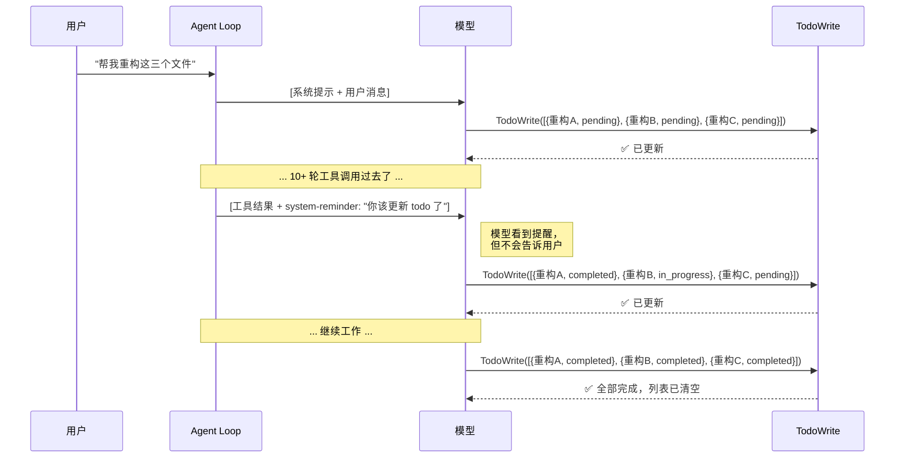

### 验证提示：完成后的最后一道关

还有一个细节——当模型一口气完成 3 个以上任务，且没有一个是"验证"步骤时，TodoWrite 会在结果中塞一句话：

```typescript
// TodoWriteTool.ts 行 76-86
const verificationNudgeNeeded =
  allDone &&
  todos.length >= 3 &&
  !todos.some(t => t.content.toLowerCase().includes('verif'))

// 如果需要验证提示，工具结果中追加：
"NOTE: You just closed out 3+ tasks and none of them was a verification step.
 Before writing your final summary, spawn the verification agent..."
```

> 做了三件事就全说"完成了"？先等等，**跑个验证再交差。** 这是 CC 对代码质量的内建保障。

### 全景：TodoWrite 在 Agent Loop 中的位置

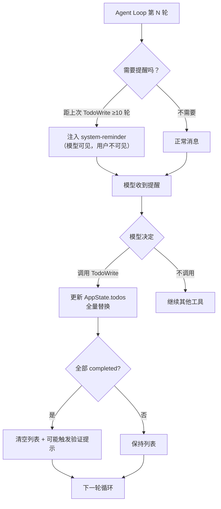

TodoWrite 的状态存储在 **AppState**（内存中），不做文件持久化。会话结束就消失——因为它本来就是为单次对话服务的"草稿纸"。

### 小结

TodoWrite 的本质是**模型的工作记忆外挂**。

- 它不改文件、不跑命令，只维护一个 `[{content, status, activeForm}]` 数组
- 通过 `system-reminder` 定期提醒模型"该更新进度了"，但**绝不让用户看到这个提醒**
- 全部完成时自动清空，3+ 任务完成时催一句"要不要验证一下"

**Agent 跑几十轮不迷路，靠的就是这张草稿纸。**

## 4. Subagent

前三节讲的都是**单个 Agent** 的故事。但有些任务一个 Agent 搞不定——比如"一边改代码一边查文档"，或者"同时在三个分支上做不同的事"。

CC 的解法：**让 Agent 生 Agent。** 模型调用 `Agent` 工具，就能启动一个子代理，子代理跑自己的 Agent Loop，跑完把结果交回来。

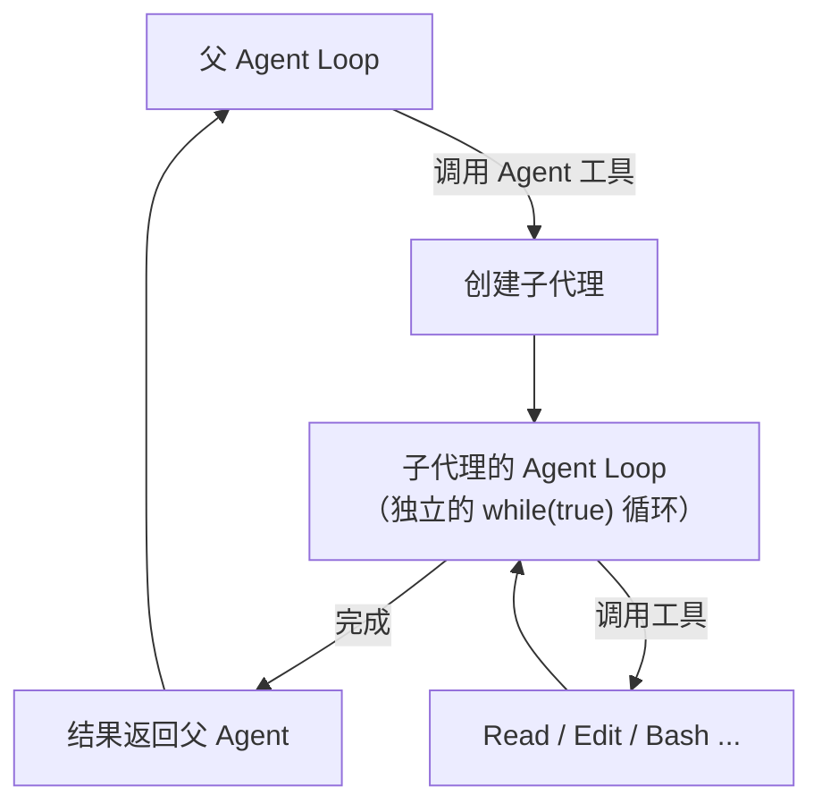

### AgentTool：怎么生一个子代理？

源码位置：[AgentTool.tsx:196](src/tools/AgentTool/AgentTool.tsx#L196)

```typescript
// ⚠️ 简化伪代码，实际约 1000 行
export const AgentTool = buildTool({
  name: 'Agent',
  inputSchema: z.object({
    prompt: z.string(),                    // 交给子代理的任务
    description: z.string(),               // 3-5 字简述
    subagent_type: z.string().optional(),  // 代理类型
    model: z.enum(['sonnet', 'opus', 'haiku']).optional(),
    run_in_background: z.boolean().optional(),
    isolation: z.enum(['worktree']).optional(),
  }),

  async call({ prompt, subagent_type, model, isolation, run_in_background }, context) {
    // ① 找到代理定义
    const agentDef = findAgentDefinition(subagent_type)
    
    // ② 组装工具池（子代理有工具限制）
    const tools = filterToolsForAgent(allTools, agentDef)
    
    // ③ 构建系统提示
    const systemPrompt = agentDef.getSystemPrompt()
    
    // ④ 如果需要 worktree 隔离
    if (isolation === 'worktree') {
      cwd = await createWorktree(slug)
    }
    
    // ⑤ 启动子代理的 Agent Loop
    if (run_in_background) {
      registerAsyncAgent(agentId, { prompt, tools, systemPrompt })
      return { status: 'running_in_background', agentId }
    } else {
      // 同步执行：跑完才返回
      return await runAgent({ prompt, tools, systemPrompt, cwd })
    }
  }
})
```

> 本质上，**子代理就是一个带有不同配置的新 Agent Loop**。它有自己的系统提示、工具列表、工作目录，但共享全局状态。

### 子代理的类型

CC 内置了多种"性格"不同的代理（[builtInAgents.ts](src/tools/AgentTool/builtInAgents.ts)）：

| 类型 | 用途 | 工具范围 | 特点 |
|------|------|---------|------|
| **general-purpose** | 通用任务 | 几乎所有工具（除 Agent 自身） | 默认类型 |
| **Explore** | 代码探索 | 只读工具（Read/Grep/Glob/WebFetch） | 不能编辑，适合调研 |
| **Plan** | 制定方案 | 只读工具 | 不能编辑，只输出计划 |
| **code-reviewer** | 代码审查 | 只读工具 | 独立审查，避免偏见 |
| **verification** | 验证结果 | 只读 + Bash | 跑测试验证，不改代码 |

每种类型本质上是一套**预设配置**：

```typescript
// builtInAgents.ts — 以 Explore 为例
const EXPLORE_AGENT: AgentDefinition = {
  agentType: 'Explore',
  tools: ['Read', 'Grep', 'Glob', 'WebFetch', 'WebSearch', 'Bash', 'ToolSearch'],
  model: 'sonnet',                    // 用更快更便宜的模型
  permissionMode: 'acceptEdits',      // 只读操作不需要频繁问权限
  getSystemPrompt: () => '你是一个代码探索专家...',
}
```

### 共享什么？隔离什么？

这是理解子代理的关键：

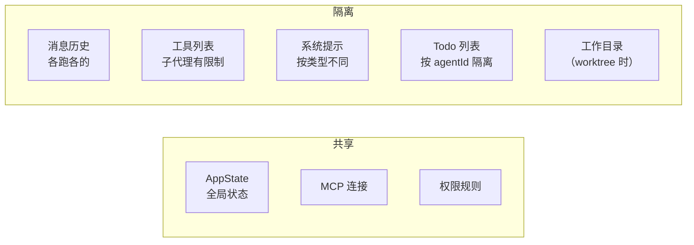

| 维度 | 共享还是隔离 | 为什么 |
|------|------------|--------|
| **AppState** | 共享 | 父子需要感知彼此的任务状态 |
| **消息历史** | 隔离 | 子代理只看到自己的 prompt，不需要父的完整对话 |
| **工具列表** | 隔离（有限制） | 子代理不能嵌套创建子代理、不能直接问用户 |
| **Todo 列表** | 隔离（按 agentId） | 各管各的任务进度 |
| **工作目录** | 可选隔离（worktree） | 防止父子同时改同一个文件冲突 |

### 工具限制：子代理不能做什么？

源码位置：[tools.ts](src/constants/tools.ts)

```typescript
const ALL_AGENT_DISALLOWED_TOOLS = new Set([
  'Agent',              // ❌ 不能嵌套创建子代理（防止无限递归）
  'AskUserQuestion',    // ❌ 不能直接问用户（只有父代理能和用户交互）
  'ExitPlanMode',       // ❌ 计划模式仅主线程控制
  'TaskOutput',         // ❌ 防止递归输出
  'TaskStop',           // ❌ 只有父代理能停任务
])
```

> 为什么禁止子代理创建子代理？想象一下：Agent 生 Agent 生 Agent……无限递归，token 爆炸，账单爆炸。**一层就够了。**

### 后台运行：不等了，先干别的

`run_in_background: true` 时，父代理不会等子代理跑完，而是立刻继续下一步。

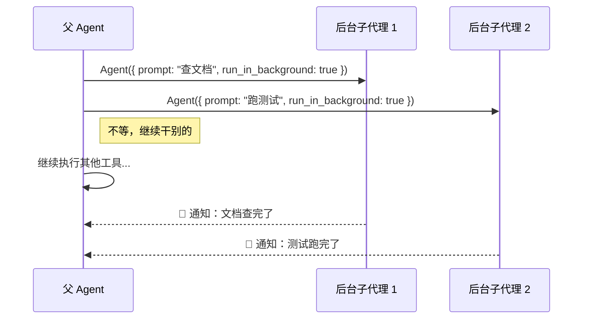

后台代理完成后通过 `enqueueAgentNotification()` 通知父代理。父代理在下一轮 Agent Loop 中看到通知，决定是否处理。

> 这就是为什么你用 CC 时，有时候会看到"某某 agent 已完成"的通知——那就是后台子代理干完活了在汇报。

### 全景：子代理在架构中的位置

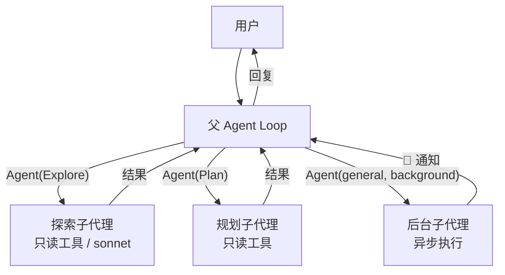

### 小结

Subagent 的本质是**用 Agent Loop 跑 Agent Loop**——同一套机制，不同的配置。

- **节省上下文**：子代理可能跑了 30 轮工具调用，但返回给父代理的只是一段结果摘要。中间过程不会撑爆父代理的上下文窗口
- **类型系统**让不同任务用不同"性格"的代理（探索用只读的，改代码用通用的）
- **工具限制**防止子代理越权（不能嵌套、不能问用户）
- **后台运行**让多个子代理并行，父代理不用干等

一句话：**一个 Agent 不够用？那就多来几个，各司其职，并行不悖。**

## 5. Skills

你肯定用过 `/commit`、`/simplify` 这些斜杠命令。它们不是硬编码的功能，而是一套叫 **Skills（技能）** 的可扩展系统。

Skill 的本质非常简单：**一个 Markdown 文件，里面写着一段 prompt。** 用户输入 `/commit`，CC 找到对应的 Skill 文件，把里面的 prompt 展开注入到对话中，模型照着 prompt 去做事。

> 就像给模型发了一张"任务卡"——卡片上写着该做什么、能用什么工具、用什么模型。

### 一个 Skill 长什么样？

每个 Skill 是一个目录，里面有一个 `SKILL.md` 文件：

```
.claude/skills/
├── my-deploy/
│   └── SKILL.md
├── gen-api-doc/
│   └── SKILL.md
```

`SKILL.md` 的格式是 **YAML frontmatter + Markdown 正文**：

```markdown
---
name: my-deploy
description: 一键部署到测试环境
allowed-tools: Bash, Read
model: sonnet
---

请执行以下部署流程：
1. 运行 `npm run build`
2. 运行 `npm run deploy:staging`
3. 检查部署结果，确认无报错
```

Frontmatter 里的字段就是这张"任务卡"的配置项：

| 字段 | 作用 | 示例 |
|------|------|------|
| `name` | 技能名称 | `my-deploy` |
| `description` | 描述（展示在 system prompt 中） | `一键部署到测试环境` |
| `allowed-tools` | 限制只能用哪些工具 | `Bash, Read` |
| `model` | 指定模型 | `sonnet`、`opus`、`haiku` |
| `context` | 执行模式 | `inline`（默认）或 `fork`（子代理） |
| `agent` | fork 模式用哪种子代理 | `general-purpose` |
| `user-invocable` | 用户能不能手动调用 | `true`（默认）/ `false` |

源码位置：[loadSkillsDir.ts:185](src/skills/loadSkillsDir.ts#L185)

### Skill 从哪来？

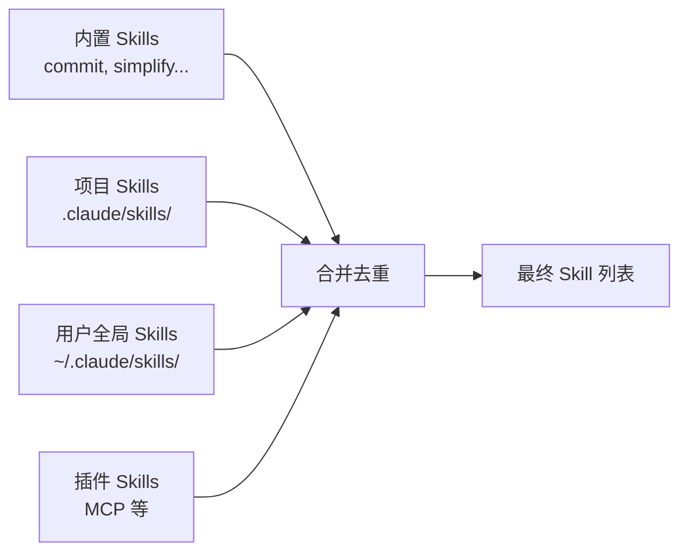

源码位置：[commands.ts:447](src/commands.ts#L447)

```typescript
// ⚠️ 简化伪代码
async function loadAllCommands() {
  const [bundledSkills, skillDirCommands, pluginSkills] = await Promise.all([
    getBundledSkills(),              // 内置：commit、simplify、loop……
    getSkillDirCommands(cwd),        // 项目 .claude/skills/ + 用户 ~/.claude/skills/
    getPluginSkills(),               // 插件和 MCP
  ])
  return [...bundledSkills, ...skillDirCommands, ...pluginSkills]
}
```

CC 内置了十几个 Skill：

| 技能 | 用途 |
|------|------|
| `simplify`（夯） | 审查代码，清理冗余 |
| `update-config` | 修改 settings.json 配置 |
| `loop` | 循环执行某个命令 |
| `claude-api` | 用 Claude API 构建应用时的专用指导 |
| `remember` | 保存记忆到 memory 文件 |
| ... | ... |

### 执行流程：从 `/commit` 到模型行动

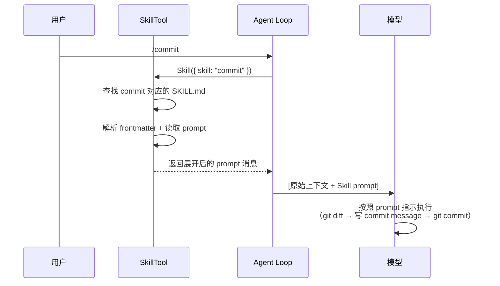

源码位置：[SkillTool.ts:580](src/tools/SkillTool/SkillTool.ts#L580)

核心执行逻辑：

```typescript
// ⚠️ 简化伪代码
async call({ skill, args }, context) {
  // ① 查找技能
  const command = findCommand(skill, await getAllCommands(context))
  
  // ② 获取展开后的 prompt
  const promptMessages = await command.getPromptForCommand(args, context)
  
  // ③ 根据执行模式选择路径
  if (command.context === 'fork') {
    // Fork 模式：在子代理中执行（独立上下文）
    return await runAgent({ agentDefinition, promptMessages })
  } else {
    // Inline 模式（默认）：prompt 注入当前对话，模型继续处理
    return {
      newMessages: promptMessages,           // 注入到消息流
      contextModifier(ctx) {
        ctx.allowedTools = command.allowedTools   // 临时限制工具范围
        ctx.model = command.model                 // 临时切换模型
      }
    }
  }
}
```

**两种执行模式的区别**：

| | Inline（默认） | Fork |
|--|---------------|------|
| 原理 | prompt 注入当前对话 | 启动子代理执行 |
| 上下文 | 共享主对话历史 | 独立上下文 |
| 适用场景 | 简单任务（commit、review） | 复杂任务（需要隔离） |
| 配置 | `context: inline` 或省略 | `context: fork` |

### 模型怎么知道有哪些 Skill？

Skill 列表被格式化后注入到 **system prompt** 中：

```typescript
// prompt.ts — 技能列表格式化（简化）
function formatCommandsWithinBudget(commands) {
  // 占 context window 的约 1%（~8000 字符）
  // 格式：
  // - commit: Create a git commit with a meaningful message
  // - simplify: Review changed code for reuse, quality, and efficiency
  // - loop: Run a prompt or slash command on a recurring interval
  // ...
}
```

所以模型看到的是这样一段提示：

```
The following skills are available for use with the Skill tool:
- commit: Create a git commit with a meaningful message
- simplify: Review changed code for reuse, quality, and efficiency  
- loop: Run a prompt or slash command on a recurring interval
...
```

当用户说"帮我提交代码"时，模型看到这个列表，**自己决定调用 `Skill({ skill: "commit" })`**。不需要用户输入 `/commit`——模型也能主动匹配。

### 小结

Skills 的本质是**可复用的 prompt 模板 + 配置**。

- 一个 `SKILL.md` 文件 = 一段 prompt + frontmatter 配置（工具、模型、执行模式）
- 四个来源：内置、项目级、用户级、插件——按需叠加
- 两种执行模式：Inline（注入当前对话）和 Fork（子代理隔离执行）
- 模型通过 system prompt 中的技能列表，**既能响应用户的 `/xxx` 命令，也能主动匹配调用**

一句话：**Skill 把"怎么做某件事"封装成一张卡片，模型照着卡片做事——这就是 prompt 的复用。**

## 6. Context Compact

Agent Loop 每跑一轮，消息列表就多一截。工具结果尤其大——读一个文件几千行、跑一次 grep 上百条匹配……跑个二三十轮，上下文窗口就快满了。

**满了怎么办？** CC 有一套多层压缩机制，像挤牙膏一样，从轻到重逐级释放空间。

### 多层压缩：从轻到重

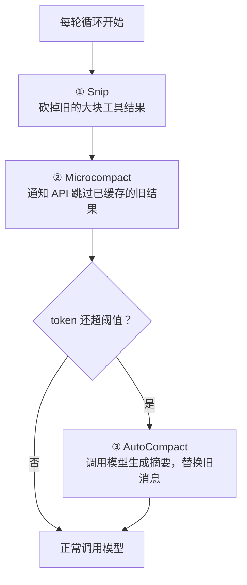

这三层都在 query.ts 的 while(true) 循环内，**每一轮都会检查**：

```typescript
// query.ts 第 307 行 while(true) 循环内（简化）
while (true) {
  // ① Snip：快速砍掉旧工具结果（不调模型，毫秒级）
  snipResult = snipCompactIfNeeded(messages)
  messages = snipResult.messages
  
  // ② Microcompact：标记旧工具结果让 API 跳过（不调模型）
  microResult = microcompactMessages(messages)
  messages = microResult.messages
  
  // ③ AutoCompact：token 还是超了？调模型生成摘要
  if (shouldAutoCompact(messages, model, snipResult.tokensFreed)) {
    compactResult = await compactConversation(messages, context)
    messages = buildPostCompactMessages(compactResult)
  }
  
  // 然后才是正常的：调模型 → 跑工具 → 下一轮
  for await (const msg of callModel({ messages, ... })) { ... }
}
```

### 第一层：Snip —— 快刀斩乱麻

最轻量的压缩：**直接砍掉早期的大块工具结果**，不调模型，不做总结。

比如你 10 轮前读了一个 2000 行的文件，那个 Read 结果现在已经没用了——Snip 直接把它截掉，腾出空间。

```
压缩前：[Read结果:2000行] [Edit结果] [Bash结果] [Read结果] ...
压缩后：[已截断] [Edit结果] [Bash结果] [Read结果] ...
```

> 速度极快（毫秒级），但粒度粗——只能砍，不能总结。

### 第二层：Microcompact —— 缓存友好的清理

比 Snip 更聪明一点：不是砍消息本身，而是**告诉 API 层跳过那些旧的工具结果**。

源码位置：[microCompact.ts:253](src/services/compact/microCompact.ts#L253)

哪些工具结果可以被 microcompact？

```typescript
const COMPACTABLE_TOOLS = new Set([
  'Read', 'Bash', 'Grep', 'Glob',
  'WebSearch', 'WebFetch', 'Edit', 'Write',
])
```

Microcompact 有两种模式：
- **缓存模式**：通过 API 的 `cache_edits` 机制，让服务端跳过这些内容——本地消息不变，但实际传给模型的 token 变少了
- **时间模式**：超过 60 分钟的旧工具结果直接清空内容

> 好处是不影响 prompt cache 命中率。缓存前缀不变，只是告诉 API"这段你可以不看"。

### 第三层：AutoCompact —— 调模型做总结

前两层都不调模型，速度快但能力有限。如果 token 还是超过阈值，就启动**重量级武器**——调一次模型，把所有旧消息总结成一段摘要。

源码位置：[autoCompact.ts:241](src/services/compact/autoCompact.ts#L241)，[compact.ts:387](src/services/compact/compact.ts#L387)


压缩后的消息结构：

```typescript
// compact.ts — 压缩后的消息列表
function buildPostCompactMessages(result: CompactionResult): Message[] {
  return [
    result.boundaryMarker,       // ① 系统消息：标记"从这里开始是压缩后的"
    ...result.summaryMessages,   // ② 模型生成的摘要（"之前我们做了X、Y、Z……"）
    ...result.messagesToKeep,    // ③ 保留的最近几条原始消息（不丢最新上下文）
    ...result.attachments,       // ④ 重新注入的附件（CLAUDE.md、技能等）
  ]
}
```

> 压缩前：100 条消息，15 万 token
> 压缩后：1 条摘要 + 最近几条消息，可能只剩 2 万 token
> 效果：**上下文释放 80%+**，但模型对早期细节的记忆会模糊

### 什么时候触发？—— 阈值计算

源码位置：[autoCompact.ts:62](src/services/compact/autoCompact.ts#L62)

```typescript
const AUTOCOMPACT_BUFFER_TOKENS = 13_000    // 自动压缩的缓冲区

// 阈值 = 有效上下文窗口 - 缓冲区
function getAutoCompactThreshold(model) {
  const effectiveWindow = getContextWindowForModel(model) - MAX_OUTPUT_TOKENS
  return effectiveWindow - AUTOCOMPACT_BUFFER_TOKENS   // 留 13K 余量
}
```

用具体数字感受一下（以 200K 上下文窗口为例）：

| 阶段 | token 数 | 状态 |
|------|---------|------|
| 正常 | < 179K | 正常运行 |
| 触发 AutoCompact | ≥ 179K | 自动调模型总结 |
| 触发阻挡 | ≥ 197K | 必须压缩才能继续 |

### 断路器：防止压缩风暴

如果压缩失败了（比如模型返回的摘要还是太长），会怎样？不断重试？不会——CC 有**断路器**保护：

```typescript
// autoCompact.ts — 连续失败 3 次就停止
if (consecutiveFailures >= 3) {
  return { wasCompacted: false }   // 不再重试，等用户手动介入
}
```

> 就像保险丝：短路了不会让电器烧掉，而是自动断电。

### 手动 /compact：用户的最后手段

除了自动压缩，用户随时可以输入 `/compact` 手动触发。区别：

| | AutoCompact | /compact |
|--|------------|---------|
| 触发方式 | 自动（token 超阈值） | 手动输入命令 |
| 缓冲区 | 13K token | 3K token（更激进） |
| 自定义指令 | 无 | 可以传参，如 `/compact 重点保留测试相关内容` |
| 追问 | 不追问（静默执行） | 可能追问细节 |

### 全景：压缩在 Agent Loop 中的位置

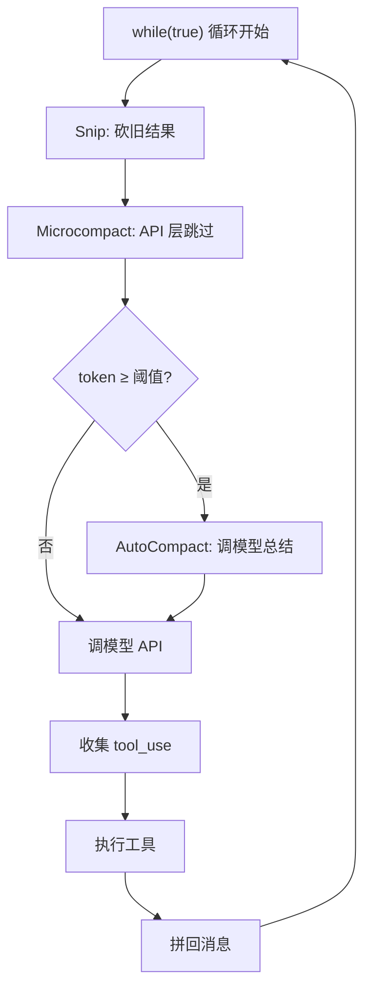

每一轮循环都经过这套"减肥流程"，确保消息列表永远不会撑爆上下文窗口。

### 小结

Context Compact 的本质是**在"记住更多"和"装得下"之间找平衡**。

- **三层递进**：Snip（砍）→ Microcompact（跳过）→ AutoCompact（总结），从快到慢，从粗到细
- **自动触发**：在 Agent Loop 的每一轮开头检查，不需要用户操心
- **断路器保护**：连续失败自动停止，不会陷入压缩死循环
- 压缩后旧消息变成一段摘要，**模型会"忘记"细节但保留全局理解**

一句话：**上下文窗口是有限的，但对话可以是无限的——靠的就是边跑边压缩。**
